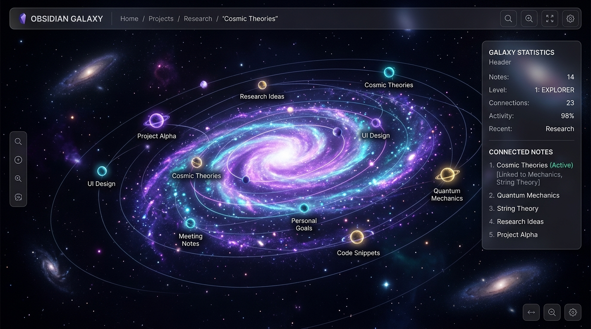

# 🌌 Obsidian Galaxy — Navigateur de Notes 3D

Obsidian Galaxy est un explorateur interactif en 3D qui transforme l'arborescence de vos notes **Obsidian** en un système stellaire. Vos dossiers et fichiers Markdown deviennent des galaxies, des étoiles, des planètes et des lunes en orbite, créant une expérience immersive pour visualiser et naviguer dans votre base de connaissances.



---

## 🚀 Concept de Cartographie Stellaire

La structure des dossiers de votre coffre (Vault) Obsidian est transposée en objets célestes selon leur profondeur :

| Élément Obsidian | Objet 3D | Description Visuelle |
| :--- | :--- | :--- |
| **Dossier Racine (Depth 0)** | 🌌 **Galaxie** | Une grande sphère lumineuse entourée d'un disque de poussière et de gaz stellaires en rotation. |
| **Sous-dossier (Depth 1)** | ☀️ **Système Solaire** | Une étoile brillante dotée d'anneaux planétaires. |
| **Sous-dossiers (Depth 2+)** | 🪐 **Planète** | Une sphère colorée avec une atmosphère vaporeuse, orbitant autour de son étoile. |
| **Fichier Markdown (.md)** | 🌙 **Lune** | Un petit satellite rocheux orbitant autour de sa planète ou dossier parent. |

---

## 🛠️ Architecture du Projet

Le projet est divisé en deux modules distincts :

1. **[obsidian-back](./obsidian-back/)** : API REST développée en **Java / Spring Boot** qui scanne votre Vault Obsidian en local et génère un arbre de données hiérarchisé de type `Universe`.
2. **[obsidian-front](./obsidian-front/)** : Application web développée en **Vite + Vanilla JS + Three.js** pour la scène de rendu 3D interactive, les contrôles orbitaux fluides et l'interface utilisateur (HUD).

---

## 📦 Installation et Lancement

### 1. Prérequis
- **Java 17+** ou **Java 21+** (pour compiler le backend)
- **Node.js 18+** (pour faire tourner le frontend)

---

### 2. Démarrer le Back-end (`obsidian-back`)

1. Modifiez le chemin de votre Vault Obsidian dans le fichier de configuration [`obsidian-back/src/main/resources/application.yaml`](./obsidian-back/src/main/resources/application.yaml) :
   ```yaml
   obsidian:
     vault-path: /Users/votre-nom/Documents/MonVaultObsidian
   ```

2. Compilez et démarrez le projet en ligne de commande :
   ```bash
   cd obsidian-back
   ./mvnw spring-boot:run
   ```
   L'API REST sera accessible à l'adresse suivante : [http://localhost:8080/api/universe](http://localhost:8080/api/universe).

---

### 3. Démarrer le Front-end (`obsidian-front`)

1. Allez dans le répertoire `obsidian-front` et installez les dépendances :
   ```bash
   cd obsidian-front
   npm install
   ```

2. Lancez le serveur de développement :
   ```bash
   npm run dev
   ```

3. Ouvrez l'application dans votre navigateur :
   👉 **[http://localhost:5173](http://localhost:5173)**

---

## 🎮 Navigation & Interactions

- **Rotation de la caméra** : Maintenez le `Clic Gauche` enfoncé et déplacez la souris.
- **Zoom avant/arrière** : Utilisez la `Molette` de la souris.
- **Sélectionner un système / astre** : Faites un `Clic` simple sur un objet céleste pour ouvrir son panneau d'informations (statistiques, nombre de notes enfants, chemin d'accès local). La caméra zoomera doucement sur l'astre sélectionné.
- **Entrer dans un sous-niveau** : Faites un `Double-Clic` sur une galaxie, une étoile ou une planète (ou cliquez sur le bouton **Entrer** dans le panneau latéral) pour voyager à l'intérieur de ce sous-dossier.
- **Ouvrir une note dans Obsidian** : Lorsque vous cliquez sur une lune (note Markdown), un bouton **Ouvrir dans Obsidian** s'affiche dans le panneau latéral pour ouvrir directement le fichier dans votre application Obsidian locale (via le protocole `obsidian://open?path=...`).
- **Retourner en arrière** : Utilisez le fil d'Ariane (**Breadcrumb**) en haut à gauche pour revenir au niveau parent, ou cliquez sur le bouton `← Retour`.

---

## ⚙️ Configuration Avancée

### Contournement CORS & Proxy
Le serveur de développement de Vite est configuré avec un proxy local (voir [`vite.config.js`](./obsidian-front/vite.config.js)) pour rediriger les requêtes `/api` vers `http://127.0.0.1:8080`. Cela évite les erreurs de blocage CORS sur le navigateur sans configuration complexe sur le back-end de production.
