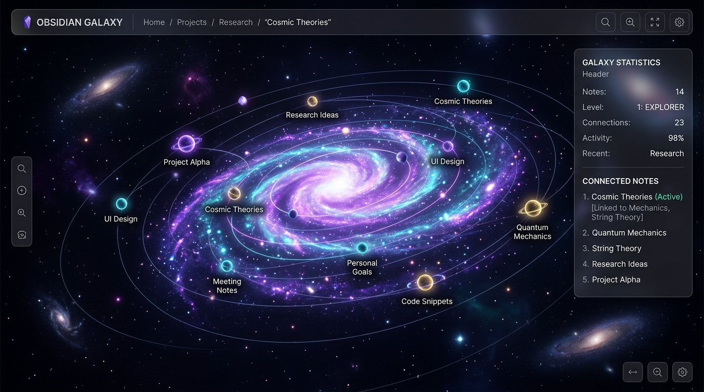

# 🌌 Obsidian Galaxy — Navigateur de Notes 3D

Obsidian Galaxy est un explorateur interactif en 3D qui transforme l'arborescence de vos notes **Obsidian** en un système stellaire. Vos dossiers et fichiers Markdown deviennent des galaxies, des étoiles, des planètes et des lunes en orbite, créant une expérience immersive pour visualiser et naviguer dans votre base de connaissances.



---

## 🚀 Concept de Cartographie Stellaire

La structure des dossiers de votre coffre (Vault) Obsidian est transposée en objets célestes selon leur profondeur :

| Élément Obsidian | Objet 3D | Description Visuelle |
| :--- | :--- | :--- |
| **Dossier Racine (Depth 0)** | 🌌 **Galaxie** | Une grande sphère lumineuse entourée d'un disque de poussière et de gaz stellaires en rotation. |
| **Sous-dossier (Depth 1)** | ☀️ **Système Solaire** | Une étoile brillante dotée d'anneaux planétaires. |
| **Sous-dossiers (Depth 2+)** | 🪐 **Planète** | Une sphère colorée avec une atmosphère vaporeuse, orbitant autour de son étoile. |
| **Fichier Markdown (.md)** | 🌙 **Lune** | Un petit satellite rocheux orbitant autour de sa planète ou dossier parent. |

---

## 🛠️ Architecture du Projet

Le projet est divisé en deux modules distincts :

1. **[obsidian-back](./obsidian-back/)** : API REST développée en **Java / Spring Boot** qui scanne votre Vault Obsidian en local et génère un arbre de données hiérarchisé de type `Universe`.
2. **[obsidian-front](./obsidian-front/)** : Application web développée en **Vite + Vanilla JS + Three.js** pour la scène de rendu 3D interactive, les contrôles orbitaux fluides et l'interface utilisateur (HUD).
3. **[obsidian-rpg-front](./obsidian-rpg-front/)** : Explorateur rétro **8-bit** développé en **Vite + Vanilla JS (Canvas 2D)** qui transforme le Vault en donjon d'exploration : chaque dossier devient une salle, chaque note un parchemin à collecter, chaque sous-dossier une porte.
4. **[obsidian-carottage-front](./obsidian-carottage-front/)** : Le Vault vu comme une **carotte de sédiments** (**Vite + Vanilla JS + SVG**) : chaque note est une strate déposée à sa date de publication, épaisse de ses mots, et les liens sont des veines entre les couches.

---

## 📦 Installation et Lancement

### 1. Prérequis
- **Java 17+** ou **Java 21+** (pour compiler le backend)
- **Node.js 18+** (pour faire tourner le frontend)

---

### 2. Démarrer le Back-end (`obsidian-back`)

1. Modifiez le chemin de votre Vault Obsidian dans le fichier de configuration [`obsidian-back/src/main/resources/application.yaml`](./obsidian-back/src/main/resources/application.yaml) :
   ```yaml
   obsidian:
     vault-path: /Users/votre-nom/Documents/MonVaultObsidian
   ```

2. Compilez et démarrez le projet en ligne de commande :
   ```bash
   cd obsidian-back
   ./mvnw spring-boot:run
   ```
   L'API REST sera accessible à l'adresse suivante : [http://localhost:8080/api/universe](http://localhost:8080/api/universe).

---

### 3. Démarrer le Front-end (`obsidian-front`)

1. Allez dans le répertoire `obsidian-front` et installez les dépendances :
   ```bash
   cd obsidian-front
   npm install
   ```

2. Lancez le serveur de développement :
   ```bash
   npm run dev
   ```

3. Ouvrez l'application dans votre navigateur :
   👉 **[http://localhost:5173](http://localhost:5173)**

---

## 🎮 Navigation & Interactions

- **Rotation de la caméra** : Maintenez le `Clic Gauche` enfoncé et déplacez la souris.
- **Zoom avant/arrière** : Utilisez la `Molette` de la souris.
- **Sélectionner un système / astre** : Faites un `Clic` simple sur un objet céleste pour ouvrir son panneau d'informations (statistiques, nombre de notes enfants, chemin d'accès local). La caméra zoomera doucement sur l'astre sélectionné.
- **Entrer dans un sous-niveau** : Faites un `Double-Clic` sur une galaxie, une étoile ou une planète (ou cliquez sur le bouton **Entrer** dans le panneau latéral) pour voyager à l'intérieur de ce sous-dossier.
- **Ouvrir une note dans Obsidian** : Lorsque vous cliquez sur une lune (note Markdown), un bouton **Ouvrir dans Obsidian** s'affiche dans le panneau latéral pour ouvrir directement le fichier dans votre application Obsidian locale (via le protocole `obsidian://open?path=...`).
- **Retourner en arrière** : Utilisez le fil d'Ariane (**Breadcrumb**) en haut à gauche pour revenir au niveau parent, ou cliquez sur le bouton `← Retour`.

---

## ✨ Nouvelles Fonctionnalités : Constellations & Astres Dynamiques

Pour rendre la cartographie plus vivante et utile, deux fonctionnalités majeures ont été intégrées :

1. **🌌 Constellations de Liens** :
   - Les notes reliées entre elles par des liens internes Obsidian (`[[Nom de Note]]`) sont connectées par des faisceaux lumineux 3D de type constellations.
   - **Interaction dynamique** : Au survol ou à la sélection d'un astre, ses lignes de connexion s'illuminent en vert intense tandis que les autres s'estompent pour améliorer la lisibilité.
   - Si une note pointe vers un élément contenu dans un sous-dossier, la connexion s'établit avec la planète représentant ce dossier.

2. **☄️ Taille Dynamique des Lunes** :
   - La taille physique de chaque lune (note) est calculée de manière logarithmique selon son poids en octets sur le disque local (`node.size`).
   - Vos notes denses et complètes apparaissent comme de gros satellites brillants, tandis que les notes courtes ou brouillons forment de plus petits corps célestes.

---

## 🕹️ Mode Exploration 8-Bit (`obsidian-rpg-front`)

Un jeu d'exploration rétro dans le style des RPG 8-bit :

- **Chaque dossier = une salle** générée procéduralement (sol, murs, décorations, thème coloré déterministe par le nom du dossier).
- **Chaque note Markdown = un parchemin** à collecter : approchez-vous et appuyez sur `E` (ou clic) pour l'ouvrir dans le **Grimoire** et le rouvrir dans Obsidian via `obsidian://open`.
- **Chaque sous-dossier = une porte** au sommet de la salle ; une porte trônée en bas permet de remonter au dossier parent.
- **Brouillard de guerre** : la carte se découvre progressivement en explorant (salle entière à l'écran, tuiles cachées dans l'ombre, minimap révélée au fil des pas).
- **Combat à l'épée** : `Espace` pour frapper les créatures (limaçons, farceurs) et gagner de l'**XP** (niveaux → +1 cœur). Les contacts font perdre des cœurs **♥** (5 max) ; les parchemins restaurent 1 cœur.
- **Gardiens** : certaines salles abritent un **boss** qui protège ses parchemins d'une aura sombre — vaincs-le pour les libérer (barre de vie en haut de l'écran). La mort ramène aux portes de la pièce (ressuscité via le bouton).
- **Grimoire / Inventaire** : collection persistante (`localStorage`, **`I`** pour relire les notes trouvées et les rouvrir dans Obsidian), notes en surplus de la salle accessibles via la **Bibliothèque**, et menu **Routes** (`Tab`) pour les couloirs trop nombreux.
- **Succès** (touche **`K`** ou bouton HUD) : 13 exploits persistés (parchemins, salles visitées, salles entièrement révélées, créatures vaincues, gardiens terrassés, niveaux, morts) — débloqués → toast + compteur en haut à droite.
- **Minimap**, fil d'Ariane cliquable (retour instantané à un ancêtre), effets sonores 8-bit (WebAudio, touche `M`).

```bash
cd obsidian-rpg-front
npm install
npm run dev
```

👉 **[http://localhost:5173](http://localhost:5173)** (port libre : `npm run dev -- --port 5175`)

---

## 🪨 Carottage (`obsidian-carottage-front`)

Une coupe géologique du Vault, rangée en tronçons comme dans une caisse de carottier. Le sélecteur **Découpage** choisit comment la carotte est coupée : une carotte **par an, semestre, trimestre ou mois** (à échelle commune, pour comparer les périodes ; une période sans publication laisse un tronçon vide), des tronçons de **longueur fixe** (5, 10, 25 ou 50 m), ou **tout sur un écran**. Le choix est retenu d'une visite à l'autre.

- **Chaque note = une strate**, déposée à sa date de publication (`published_at` du frontmatter) : la surface est la note la plus récente, le fond la plus ancienne. **Épaisseur = nombre de mots** (1 mot = 1 mm).
- **Couleur et figuré = dossier** (lithologie) ; les dossiers dominants sont découpés en sous-dossiers, les plus rares regroupés en « divers ».
- **Sédiments meubles** en surface : les brouillons (`status: Draft`). **Socle** au fond : les notes sans date.
- **Lacunes** (trait rouge en dents de scie) : plus de deux mois sans publication. **Fossiles directeurs** (ammonites) : les notes les plus citées.
- Survol : **veines** vers les notes citées (trait plein) et citantes (pointillé). Clic : **fiche d'échantillon** (date, profondeur, tags, extrait, liens, ouverture dans Obsidian ou en ligne via `source_url`).
- Filtre (`/`) : mots du titre, `#tag`, `dossier:Back/Java` ; `↑`/`↓` pour passer d'une couche à l'autre.

```bash
cd obsidian-carottage-front
npm install
npm run dev
```

---

## ⚙️ Configuration Avancée

### Contournement CORS & Proxy
Le serveur de développement de Vite est configuré avec un proxy local (voir [`vite.config.js`](./obsidian-front/vite.config.js)) pour rediriger les requêtes `/api` vers `http://127.0.0.1:8080`. Cela évite les erreurs de blocage CORS sur le navigateur sans configuration complexe sur le back-end de production.
